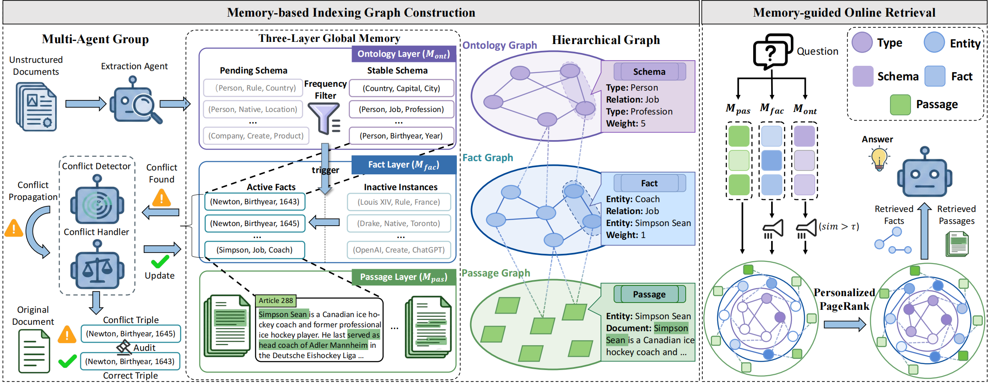

# 【KDD 2026】MemGraphRAG: Memory-based Multi-Agent System for Graph Retrieval-Augmented Generation

A three-layer memory structure for knowledge graph retrieval and generation, designed to organize extracted information into a hierarchical memory system with inter-layer connections.

## Overview

MemGraphRAG implements a three-layer memory architecture that bridges unstructured text passages with structured knowledge graphs:



## Architecture

### 1. Entity Extraction (`entity_type_extract.py`)

Extracts named entities from text using spaCy's transformer-based model:

- Splits text into chunks of fixed token length (default: 512 tokens)
- Uses `en_core_web_trf` model for entity recognition
- Outputs entities with text, label, start/end character positions

### 2. Relation Extraction (`schema_fact_extract.py`)

Extracts relations between entities using LLM:

- Takes entity-extracted chunks as input
- Uses LLM to identify meaningful relations between entities
- Outputs relation triples: `(head, relation, tail)` with types: `(head_type, relation, tail_type)`
- Supports batch parallel processing

### 3. LLM Client (`llm_client.py`)

Reusable LLM client with advanced features:

- OpenAI-compatible API support
- SQLite-based response caching
- Parallel batch request processing
- Automatic JSON response parsing
- Configurable retry mechanism

### 4. Prompt System (`prompt.py`, `prompt_builder.py`)

Contains prompts for various tasks:

- **Relation Extraction**: Extract structured triples from entities
- **Conflict Detection**: Identifies three conflict types:
  - Mutual conflict (one-to-one relations)
  - Temporal conflict (time-dependent facts)
  - Granularity conflict (different specificity levels)
- **Conflict Resolution**: Resolves conflicts using source passages

### 5. Ontology Filtering (`ontology_filtering.py`)

Filters and enriches extracted knowledge:

- Removes low-frequency ontologies
- Adds metadata fields:
  - `unique_ontologies`: Unique schema patterns per chunk
  - `entity_mapping`: Type-entity correspondences

### 6. Three-Layer Memory (`memory.py`)

Core memory structure implementation:

- **Schema Layer**: Stores ontology patterns (type triples)
- **Fact Layer**: Stores extracted triples
- **Passage Layer**: Stores original text chunks
- Inter-layer index relationships for bidirectional navigation
- Serialization support (JSON save/load)

### 7. Conflict Resolution (`resolve_conflict.py`)

Detects and resolves triple conflicts:

- Finds related triples by shared entities
- Uses embedding similarity to find semantically similar facts
- LLM-based conflict classification
- Resolution strategies: keep, discard, or modify

## Installation

```bash
pip install spacy httpx openai filelock numpy pandas

# Download spaCy model
python -m spacy download en_core_web_trf
```

## Usage

### Step 1: Entity Extraction

```python
from entity_type_extract import EntityExtractor

extractor = EntityExtractor(
    model_name="en_core_web_trf",
    chunk_size=512
)

extractor.process_file("input.txt", "output_entities.json")
```

### Step 2: Relation Extraction

```python
from schema_fact_extract import RelationExtractor
from llm_client import LLMConfig

llm_config = LLMConfig(
    model_name="gpt-4o-mini",
    temperature=0.0
)

extractor = RelationExtractor(llm_config=llm_config)
extractor.process_file("output_entities.json", "output_relations.json")
```

### Step 3: Build Memory Structure

```python
from memory import ThreeLayerMemory, load_openie_results

data = load_openie_results("filtered_results.json")
memory = ThreeLayerMemory()
memory.build_from_openie_results(data)

# Save memory
memory.save("memory.json")
```

### Step 4: Conflict Detection & Resolution

```python
from resolve_conflict import detect_triple_conflicts, load_all_triples_with_ids

triple_list, triple_ids = load_all_triples_with_ids("openie_results.json")

result = detect_triple_conflicts(
    triple_list=triple_list,
    triple_ids=triple_ids,
    llm_model=llm_model,
    embedding_model=embedding_model,
    fact_id_to_fact=fact_id_to_fact
)
```

## Key Features

- **Hierarchical Organization**: Three-layer structure from abstract schemas to concrete passages
- **Bidirectional Indexing**: Navigate between layers via index relationships
- **Semantic Search**: Vector-based similarity search across facts
- **Conflict Resolution**: Automated detection and resolution of contradictory facts
- **Caching**: SQLite-based caching for LLM responses
- **Parallel Processing**: Efficient batch processing for large datasets

## Dependencies

- Python 3.8+
- spaCy (with transformer model)
- OpenAI SDK
- NumPy
- Pandas
- httpx
- filelock

